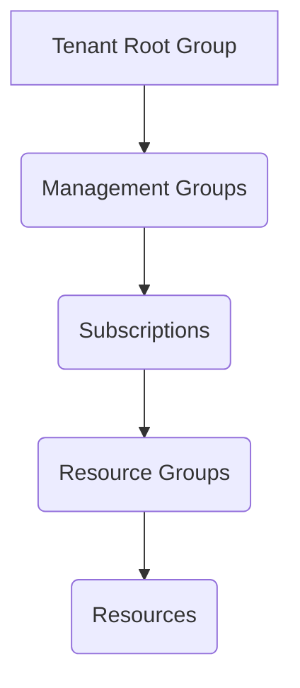
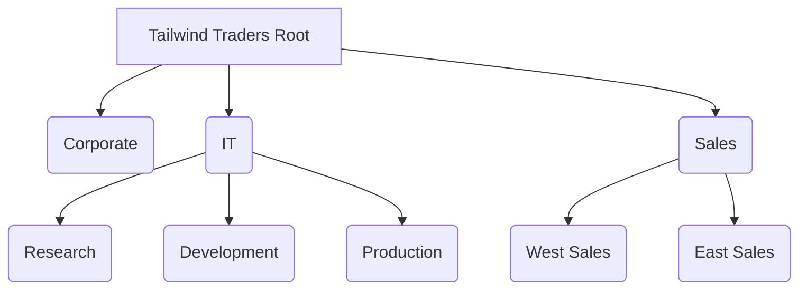
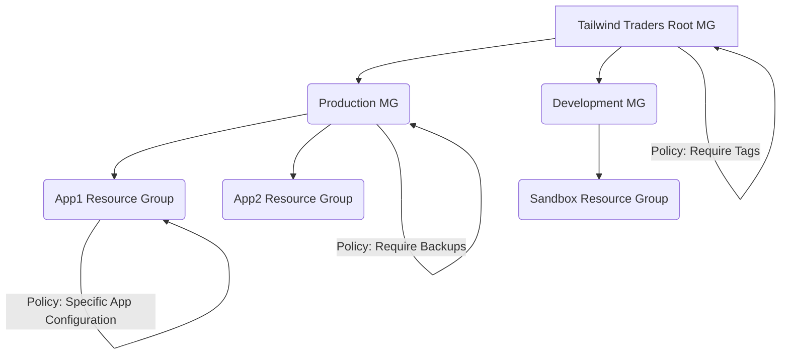
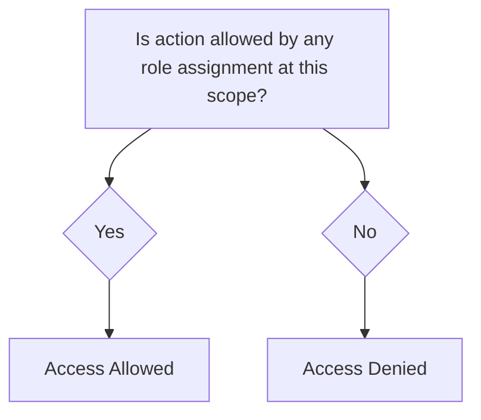
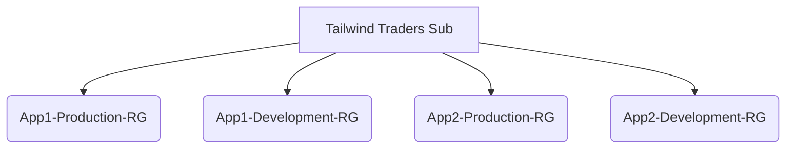

# AZ-305 Study Notes: Design identity, governance, and monitor solutions

Welcome to my personal notes on designing governance solutions in Azure, a key part of the AZ-305 exam syllabus. Governance in Azure is all about setting up the rules of the road, making sure our resources are compliant, secure, and well-managed. It's the backbone that supports everything we build in the cloud.

## What is Azure Governance?

At its core, governance provides the **mechanisms and processes** we need to maintain control over our applications and resources in Azure. It involves figuring out our organization's requirements, planning our cloud journey, and setting clear strategic priorities. Think of it as establishing your company's policies and procedures for using Azure. To make governance effective, we need a structured environment. Azure provides a **hierarchical structure** that allows us to apply governance strategies precisely where they're needed.

The main governance tools we'll focus on here are **Azure Policy** and **Resource Tags**.

## Understanding the Azure Hierarchy

Before we apply any governance, we need to understand the landscape. Azure resources are organized in a specific hierarchy. Getting this structure right is crucial for effective management and policy enforcement.

Here's a visual representation of the typical Azure hierarchy:



**Let's break down each level:**

*   **Tenant Root Group:** This is the top-level container for all your Azure resources. It's linked to your Microsoft Entra ID (formerly Azure AD) tenant. All your management groups and subscriptions roll up to this root.
*   **Management Groups:** These are containers that help manage access, policy, and compliance for *multiple subscriptions*. They allow you to apply policies and access controls across a broad scope.
*   **Subscriptions:** These are logical containers that act as **units of management and scale**. Importantly, they are also **billing boundaries**. Policies and roles can be applied at the subscription level.
*   **Resource Groups:** These are logical containers where we **deploy and manage Azure resources**. Resources within a group often share the same lifecycle.
*   **Resources:** These are the actual instances of services you create and use, like Virtual Machines, Storage Accounts, SQL Databases, Web Apps, etc.

Understanding this hierarchy is fundamental because policies and access controls typically **inherit down** the structure.

## Deep Dive: Management Groups

Management groups are a powerful way to organize subscriptions and apply governance at scale. They sit above subscriptions in the hierarchy.

**Why use Management Groups?**

*   **Centralized Policy Assignment:** Apply policies (like requiring specific tags or limiting regions) across numerous subscriptions simultaneously.
*   **Centralized Access Management:** Grant user access to multiple subscriptions with a single role assignment at the management group level.
*   **Simplified Monitoring:** Monitor and audit role and policy assignments across your entire organization or specific groups of subscriptions.

**Key Things to Know About Management Groups:**

*   They aggregate policy and initiative assignments via Azure Policy.
*   A management group tree can have **up to six levels of depth** (excluding the tenant root and subscription levels). Keep this limit in mind when designing your hierarchy.
*   Azure RBAC authorization for management group operations is **not enabled by default** – you need to explicitly configure access.
*   By default, all new subscriptions land under the **root management group**. You'll need to move them into your custom hierarchy.

**Designing Your Management Group Hierarchy (Tailwind Traders Example):**

Designing the right hierarchy requires careful thought. It should align with your organization's structure, governance needs, and operational model.

Let's look at the Tailwind Traders example with departments like Sales, Corporate, and IT, and regional Sales offices (West/East).

Here's a possible management group hierarchy for Tailwind Traders:



*(This is a conceptual diagram based on the description)*

**Important Considerations When Creating Management Groups:**

*   **Design with Governance in Mind:** Place Azure policies that apply to broad sets of workloads (like security standards or connectivity requirements) at the management group level.
*   **Keep it Reasonably Flat:** While you *can* go six levels deep, aiming for **no more than three or four levels** is often recommended. A very deep hierarchy can become complex to manage. A flat hierarchy (just root -> department -> subscription) might lack flexibility for large orgs, but too many levels add complexity. Find a balance.
*   **Consider a Top-Level Management Group:** Implementing one like `Tailwind Traders Root` is excellent for applying common platform policies and RBAC assignments that should cover *everything* in your tenant.
*   **Align with Organizational/Departmental Structure:** Structuring management groups by departments (Sales, Corporate, IT) is a common and effective approach, as it naturally aligns governance with business units.
*   **Consider Geographical Structure:** If compliance or policy needs vary by region (like the West and East sales offices), separate management groups can help enforce regional policies.
*   **Consider a Production Management Group:** Having a dedicated group for production environments (like the IT Production group) allows you to enforce stricter policies that only apply to critical production workloads.
*   **Consider a Sandbox Management Group:** This is a fantastic idea! Provide a sandbox environment where users can experiment *safely*, isolated from your dev, test, and production environments. Policies here might be more relaxed but could include cost controls or resource type restrictions.
*   **Isolate Sensitive Information:** Create dedicated management groups for workloads handling sensitive data (like the Corporate group handling HR/Legal). Apply enhanced compliance policies here.

**Key Takeaway:** Plan your hierarchy based on where you need to apply common policies and access controls. Don't just mirror your exact org chart if it doesn't make sense from a governance perspective.

## Resource Tagging: Adding Metadata for Management

Resource tags are simple key-value pairs that you can apply to your Azure resources, resource groups, and subscriptions. While seemingly simple, they are incredibly powerful for governance, cost management, operations, and more.

Think of tags as labels you stick on your resources to categorize them.

**Common Resource Tag Types:**

| Tag Type        | Description                                                                 | Example Name-Value Pairs              |
| :-------------- | :-------------------------------------------------------------------------- | :------------------------------------ |
| **Functional**  | Categorizes resources by their purpose, environment, or operational details. | `app = catalogsearch1`, `env = production`, `tier = web`, `webserver = apache` |
| **Classification** | Identifies a resource by how it's used and what policies apply (compliance, SLA). | `confidentiality = private`, `SLA = 24hours` |
| **Accounting**  | Associates resources with specific groups for billing/cost allocation.      | `department = finance`, `program = business-initiative`, `region = northamerica` |
| **Partnership** | Provides info about non-IT stakeholders or owners.                          | `owner = jsmith`, `contactalias = catsearchowners`, `stakeholders = user1;user2;user3` |
| **Purpose**     | Aligns resources to business functions for investment decisions.              | `businessprocess = support`, `businessimpact = moderate`, `revenueimpact = high` |

**Important Considerations for Tagging:**

*   **Start Small, Then Scale:** Don't try to define *every single possible tag* upfront. Start with a few critical tags (like `Environment`, `Owner`, `CostCenter`) and see how effective they are. Iterate and add more as needed.
*   **Use Azure Policy to Enforce Tagging:** Tagging is only useful if it's applied consistently! Use Azure Policy to **require specific tags** on new resources. You can even use Policy to **reapply tags** if they are removed or **inherit tags** from the resource group or subscription. This is a crucial governance step.
*   **Decide Which Resources Require Tagging:** You don't necessarily need to tag *everything*. You might decide that only mission-critical resources must have an `Impact` tag. This implies that any resource *without* that tag is *not* considered mission critical by default.

**Exam Tip:** Expect questions about how to use tags for cost management, resource organization, and policy enforcement. Azure Policy is the primary tool for *enforcing* your tagging strategy.

## Azure Policy: Enforcing Your Rules

Azure Policy is a service that allows you to create, assign, and manage policies that **control or audit** your resources. Policies enforce rules over resource configurations to ensure they stay compliant with your corporate standards or regulatory requirements.

**How Does Azure Policy Work?**

*   You define **policy definitions** (rules, conditions, and effects) or **initiative definitions** (groups of related policies). Azure provides many built-in definitions.
*   You **assign** these policies or initiatives to a specific **scope** (management group, subscription, or resource group).
*   Azure Policy **evaluates** resources within that scope against the assigned policies.
*   It then reports on **compliance** and can take **actions** based on the policy effect (e.g., deny creation, audit, modify, deploy if not exists).

**Key Things to Know About Azure Policy:**

*   It allows you to define individual policies and **initiatives** (sets of policies).
*   Policies are **inherited down the hierarchy**. An assignment at a management group applies to all subscriptions and resource groups below it.
*   You can scope policies at **different levels** (management group, subscription, resource group).
*   Azure Policy evaluates resources in Azure **and** Arc-enabled resources (resources outside Azure connected via Azure Arc).
*   It highlights resources that are **non-compliant** in the compliance dashboard.
*   Policy can be used to **prevent noncompliant resources** from being created (`Deny` effect) or **automatically remediate** noncompliant resources (`DeployIfNotExist`, `Modify` effects).
*   It integrates with **Azure Pipelines** for applying policies during your CI/CD process.

**Applying Azure Policy (Tailwind Traders Example):**

Tailwind Traders might apply stricter policies at the Production management group level (e.g., only allowing specific VM sizes, requiring backups) and slightly different policies at the Development or Sandbox levels. Application-specific policies could be assigned at the resource group level for a particular application.



*(This is a conceptual diagram showing policy assignment scope)*

**Important Considerations When Using Azure Policy:**

*   **Use the Compliance Dashboard:** This is your central hub for monitoring policy compliance. It provides an aggregate view and allows you to drill down. It also supports **bulk remediation** for existing noncompliant resources.
*   **Understand Evaluation Triggers:** Policy evaluations aren't instantaneous in all cases. Know what triggers an evaluation:
    *   A resource is created, updated, or deleted.
    *   A policy or initiative is newly assigned or updated.
    *   The **standard compliance evaluation cycle** (occurs roughly **every 24 hours**). Be aware of this delay when expecting compliance reports.
*   **Decide How to Handle Noncompliant Resources:** What should happen when a resource violates a policy?
    *   **Deny:** Prevent the action (creation or update) that would make the resource noncompliant. Strict but effective.
    *   **Audit:** Allow the action but flag the resource as noncompliant in the dashboard. Useful for monitoring before enforcing.
    *   **Modify:** Alter a property on the resource *during* creation or update to make it compliant.
    *   **DeployIfNotExist:** Deploy a related compliant resource if the evaluated resource is missing it (e.g., deploy a diagnostic setting if not present).
*   **Consider Automatic Remediation:** Use the `DeployIfNotExist` or `Modify` effects to automatically fix noncompliant resources. This is great for enforcing tagging, deploying monitoring agents, etc.
*   **Azure Policy vs. Azure RBAC - Know the Difference!** This is a frequently misunderstood concept and a likely exam topic. While both are governance tools, they do fundamentally different things. **They should be used together!**

**Azure Policy vs. Azure RBAC Comparison:**

| Feature       | Azure Policy                                         | Azure RBAC                                                |
| :------------ | :--------------------------------------------------- | :-------------------------------------------------------- |
| **Description** | Defines rules to ensure resource configurations are compliant with standards. | Authorization system granting fine-grained access controls. |
| **Main Focus**| Focused on the **properties** of resources (What the resource *looks like*). | Focused on **user actions** (Who can do *what*).           |
| **Goal**      | Ensure the state of resources is compliant.          | Manage *who* can access resources and *what* they can do. |
| **Mechanism** | Specify a set of rules (definitions, assignments, effects). | Assign roles (sets of permissions) to security principals (users, groups, service principals) at a scope. |
| **Default**   | By default, policy rules are typically set to **allow** (audit or allow effects don't block actions). | By default, **all access for all users is denied**. Access must be explicitly granted via a role assignment. |

**Think of it this way:**
*   **RBAC:** "Can John Doe deploy a Virtual Machine?" (Focuses on the user's *permission* to perform the action).
*   **Policy:** "Is the Virtual Machine being deployed using an approved image and in an allowed region, and does it have the correct tags?" (Focuses on the *properties* of the resource being deployed).

If RBAC allows an action, but Policy denies it (e.g., the VM has the wrong tag), the action is blocked. Policy acts as a guardrail *after* RBAC has granted permission to perform an action.

## Controlling Resource Access: Introducing RBAC

Once identities are managed (via Microsoft Entra ID), the next step is controlling what those identities can **access** and **do** within Azure. This is primarily the domain of **Azure Role-Based Access Control (RBAC)**.

Beyond RBAC, other tools like Microsoft Entra Conditional Access, Microsoft Entra ID Protection, and Microsoft Entra Access Reviews help manage and monitor access throughout a user's lifecycle. But RBAC is the core authorization system for Azure resources.

## Deep Dive: Azure Role-Based Access Control (RBAC)

Azure RBAC is the authorization system that allows you to grant access to Azure resources. When a user tries to perform an action, RBAC evaluates the request to determine if access is allowed.

**RBAC is an **Allow Model**. What does this mean?**

It means that if a role assignment grants a user permission to perform an action, they can perform that action. Access is granted by assigning roles. Unlike a deny model where permissions are explicitly denied, RBAC starts with denial and grants access through assignments.

Here's a simplified view of the RBAC decision flow:



*(Conceptual RBAC decision flow)*

**Key Things to Know About Azure RBAC:**

Azure RBAC enables fine-grained access management. Here are scenarios you can achieve:

*   Allow User A to manage VMs in Subscription X, and User B to manage Virtual Networks in the same subscription.
*   Allow a Microsoft Entra security group (e.g., 'DB Admins') to manage SQL databases in a specific subscription.
*   Allow a user to manage *all* resources (VMs, websites, databases) within a specific resource group.
*   Grant a Service Principal (used by applications) access to resources in a resource group.

**Important Considerations When Using Azure RBAC:**

Integrating RBAC effectively requires planning how it complements your policy strategy.

*   **Assign Roles at the Highest Necessary Scope:** Define your roles and permissions accurately. Then, assign these roles to users, groups, or service principals. **Crucially, assign the role at the highest scope level (management group, subscription, resource group, resource) that meets the requirements.** Avoid assigning broad permissions at a lower scope if a higher scope works.
    ```mermaid
    graph TD
        A[Role Definition] --> B(Assigned To: User/Group/SP);
        B --> C(Scoped To: MG/Sub/RG/Resource);
    ```
    *(Diagram showing the components of an RBAC assignment)*
*   **Grant Least Privilege:** This is a fundamental security principle. Grant users *only the permissions they need* to perform their job, nothing more. This limits the blast radius if an account is compromised. Planning this out helps:
    ```mermaid
    graph TD
        A[Tailwind Traders] --> B(IT Department);
        B --> C{Resource Group: Production};
        C --> D(Role: Contributor);
        B --> E{Resource Group: Development};
        E --> F(Role: Reader);
    ```
    *(Conceptual diagram showing different roles for a department across different scopes)*
*   **Assign Roles to Groups, Not Users:** Manage access more efficiently by assigning roles to Microsoft Entra security groups. Add or remove users from the group to manage their access, rather than managing individual role assignments per user. This significantly reduces the administrative overhead, especially in large organizations.
*   **Consider When to Use Azure Policies:** Remember the comparison table above! RBAC is about *who* can do *what*, Policy is about *what the resource looks like*. Use Policy to enforce configuration standards (e.g., requiring encryption) even if a user has RBAC permission to create the resource.
*   **Consider Creating Custom Roles:** Built-in roles (like Reader, Contributor, Owner) cover many scenarios, but sometimes you need a very specific set of permissions. You can create **custom roles** that combine permissions exactly as needed. Custom roles can be shared across subscriptions within the same Microsoft Entra tenant.
*   **Resolving Overlapping Role Assignments:** RBAC is an **additive** model. Your effective permissions are the *sum* of all your role assignments at different scopes. If a user has the Reader role on a subscription and the Contributor role on a resource group within that subscription, their effective permission on that resource group is Contributor (which includes Reader permissions). The Reader assignment has no practical effect in this case.

## Designing for Subscriptions

Subscriptions are foundational to structuring your Azure environment. They serve multiple purposes:

*   **Logical Containers:** Organize resources and workloads.
*   **Units of Management and Scale:** Provide boundaries for management and scaling.
*   **Billing Boundaries:** Crucially, they define how you are billed for Azure consumption.

**Key Things to Know About Subscriptions:**

*   You **must** have a subscription to use Azure services.
*   Different subscription types exist (e.g., Enterprise Agreement, Pay-As-You-Go).
*   Subscriptions can provide **separate billing environments** (e.g., a Dev subscription, a Test subscription, a Prod subscription for cost separation).
*   Policies can be applied at the subscription level to meet different **compliance standards**.
*   They help manage and track costs for different parts of your organization.
*   They can be used to **organize specialized workloads** that might hit service limits within a single subscription.

**Important Considerations When Creating Subscriptions:**

Once your management group structure is planned, decide how to map subscriptions to it.

*   **Treat Subscriptions as a Democratized Unit:** Align subscriptions with specific business needs and priorities. Empower teams or business units with their own subscriptions where appropriate.
*   **Group Subscriptions Under Management Groups:** Place subscriptions with similar governance needs (policies, RBAC) under the same management group so they inherit those settings. For Tailwind Traders, West and East Sales subscriptions would go under the Sales management group.
*   **Consider a Dedicated Shared Services Subscription:** This is a common pattern. Put shared infrastructure like network hubs (ExpressRoute, Virtual WAN), central logging, security tools, etc., into a separate subscription. This isolates their costs and management from application workloads.
*   **Consider Subscription Scale Limits:** Azure has service limits per subscription (e.g., number of network watchers, number of Data Factory integrations). Large, specialized workloads (HPC, SAP, IoT) might require their *own* subscriptions to avoid hitting these limits. Design subscriptions to accommodate workload scale needs.
*   **Consider Administrative Management:** Subscriptions create a management boundary. Does your organization need separate administrators for different sets of resources or departments? Subscriptions support this separation of concerns. The Corporate group might have one subscription for HR and Legal if managed by the same team.
*   **Consider How to Assign Azure Policies:** Both management groups and subscriptions are policy assignment boundaries. If a specific workload (like PCI compliant apps) needs extra policies, you could place them in a dedicated subscription rather than creating a management group just for that compliance need, depending on your overall hierarchy design. Avoid having too many management groups with just one or two subscriptions.
*   **Consider Network Topologies:** Virtual Networks are scoped to a subscription. If workloads in different subscriptions need to communicate, you'll need to implement networking solutions like Virtual Network Peering or VPNs. Plan your subscription boundaries considering communication requirements.
*   **Make Subscription Owners Aware of Responsibilities:** Clearly define the roles and responsibilities of subscription owners. Regularly review access (e.g., quarterly access reviews using Microsoft Entra Privileged Identity Management) to ensure access remains appropriate as people change roles.

**My Thought:** There's no one-size-fits-all approach to subscription design. It depends heavily on your organization's size, structure, billing requirements, compliance needs, and operational model. Be flexible and iterate on your design.

## Designing for Resource Groups

Resource groups are the most granular logical containers for deploying and managing resources.

**Why Use Resource Groups?**

*   **Logical Grouping:** Place resources with similar usage, type, or location together.
*   **Lifecycle Management:** Group resources that share the same lifecycle (e.g., all resources for App1's production environment). When you delete the resource group, all resources within it are deleted. This is incredibly useful for managing environments.
*   **Apply Role Permissions:** Grant a user or group permissions to manage *all* resources within a specific resource group.
*   **Use Resource Locks:** Apply locks to resource groups to prevent accidental deletion or modification of resources inside.

**Key Things to Know About Resource Groups:**

*   Resource groups have a **location** (region) assigned. This is where the *metadata* about the resources is stored.
*   If the resource group's region is unavailable, you **cannot update** resources in that group because the metadata is inaccessible. The resources themselves in their respective regions *will continue to function*.
*   Resources *within* a resource group can reside in **different regions**.
*   Resources can connect to resources in **other resource groups**. (e.g., a web app in RG1 connecting to a database in RG2).
*   Resources can generally be **moved** between resource groups (with some exceptions).
*   You can add or remove a resource from a resource group at any time.
*   Resource groups **cannot be nested**.
*   Each resource must belong to **exactly one** resource group.
*   Resource groups **cannot be renamed**.

**Designing Your Resource Groups (Tailwind Traders Example):**

For Tailwind Traders with App1 and App2, each having web services, databases, VMs, and storage, a common pattern is to organize resource groups by application and environment.



*(Conceptual diagram showing resource groups organized by application and environment)*

This structure makes managing the lifecycle of each application environment straightforward. You can apply policies or RBAC roles to the `App1-Production-RG` that are specific to that environment.

## Azure Landing Zones: A Foundation for Scale

An Azure landing zone provides a pre-configured infrastructure environment designed to host your workloads effectively and securely. It ensures that foundational principles and services are in place *before* you deploy applications.

**Think of the City Utilities Analogy:**

Just like a city ensures water, power, and roads are available before homes are built, an Azure landing zone makes sure fundamental services like networking, identity and access management (IAM), policies, and monitoring configurations are ready. This streamlines the process of migrating or building applications.

**Key Things to Know About Azure Landing Zones:**

*   They represent **management groups and subscriptions** structured to scale based on business needs.
    ```mermaid
    graph TD
        A[Tenant Root Group] --> B(Platform MG);
        A --> C(Landing Zones MG);
        C --> D(Corporate Landing Zone Sub);
        C --> E(SAP Landing Zone Sub);
        C --> F(Online Landing Zone Sub);
    ```
    *(Conceptual diagram showing landing zones within the hierarchy)*
*   **Azure Policies** are tightly integrated and associated with landing zones to enforce continuous compliance.
*   Landing zones are ideally **pre-provisioned through code** (Infrastructure as Code - IaC) for consistency and repeatability.
*   A landing zone can be scoped to support **application migrations and greenfield development** across the organization's entire IT portfolio.
*   The **Azure landing zone accelerator** provides a full, opinionated implementation of the conceptual architecture that you can deploy into your existing tenant.

**Important Considerations When Using Azure Landing Zones:**

Incorporating landing zones is about establishing a scalable, well-governed foundation.

*   **Include Landing Zones in Your Design:** They are not just for large organizations; they represent best practices for structuring your environment. Use subscriptions as units of management/scale and apply Policy for guardrails and compliance.
*   **Create Landing Zones Through Code:** Use IaC (like Bicep, ARM templates, Terraform) to build your landing zones. Treat your infrastructure as code that can be versioned and refactored iteratively. A central IT team reviewing short/long-term needs is key here.
*   **Use the Azure Landing Zone Accelerator:** This is a great starting point! It implements the conceptual architecture and includes recommended configurations for management groups and policies.
*   **Focus on Application-Centric Migrations:** Landing zones are built to facilitate deploying applications, whether migrating existing ones or building new cloud-native apps, rather than just lift-and-shift VM migrations.
*   **Favor Azure-Native Design:** Align with the Azure platform roadmap by using native services and capabilities where possible.
*   **Scope for Both Migrations and Greenfield:** Design landing zones flexible enough to support both bringing existing applications to Azure and building entirely new ones.
*   **Transition Existing Architectures:** You can deploy the landing zone accelerator *in parallel* with your current Azure environment within the same tenant. This creates a new structure (management groups, subscriptions) without impacting your existing resources, allowing for a phased transition.

**Note:** Conducting an Azure landing zone review is highly recommended, especially if you plan to host significant workloads. The assessment tools can help identify areas for investment in your cloud adoption strategy.

---

This covers the core concepts of designing governance solutions in Azure, including the hierarchy, tagging, policies, RBAC, subscriptions, resource groups, and landing zones. Understanding how these components work together is essential for designing a well-managed, compliant, and scalable Azure environment, and it's definitely a key area for the AZ-305 exam!

Remember to integrate these concepts – RBAC grants permission, Policy enforces configuration standards, Tags provide metadata for organization and policy enforcement, and the hierarchy provides the scope for applying all of these. Landing zones wrap it all up into a best-practice foundational structure.

Good luck with your studies!

### Resources/Links:

*   [Azure management groups documentation](https://learn.microsoft.com/en-us/azure/governance/management-groups/overview)
*   [What is Azure Policy?](https://learn.microsoft.com/en-us/azure/governance/policy/overview)
*   [What is Azure role-based access control (Azure RBAC)?](https://learn.microsoft.com/en-us/azure/role-based-access-control/overview)
*   [What is an Azure resource group?](https://learn.microsoft.com/en-us/azure/azure-resource-manager/management/overview)
*   [Azure landing zones documentation](https://learn.microsoft.com/en-us/azure/cloud-adoption-framework/ready/azure-landing-zone/)
*   [Azure Policy effects](https://learn.microsoft.com/en-us/azure/governance/policy/concepts/effects)

---